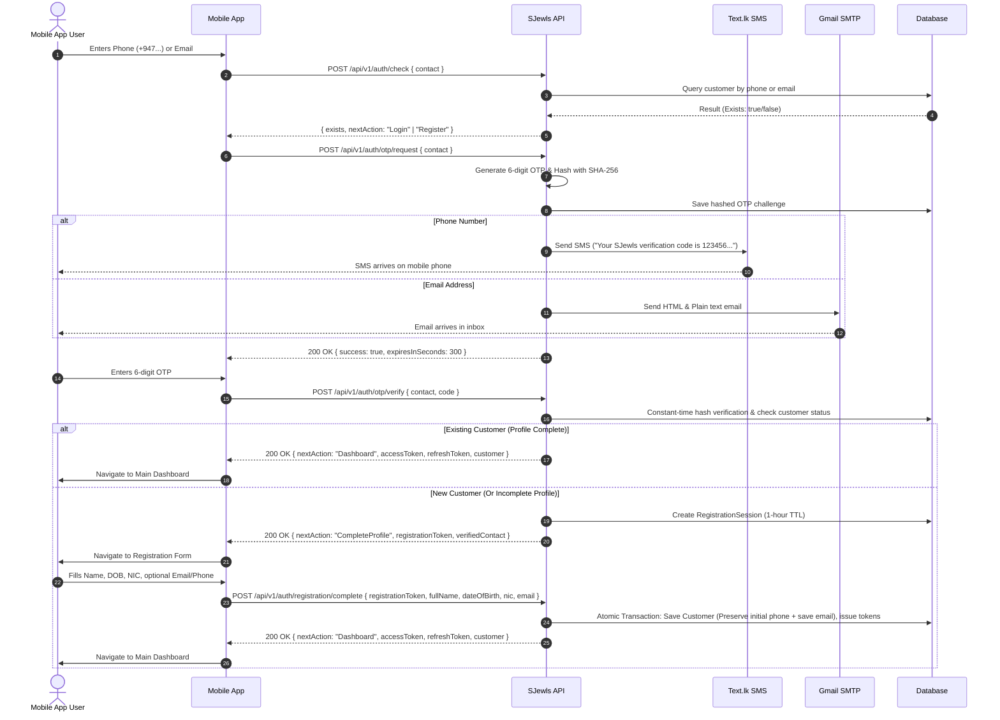

# SJewls Mobile Authentication & Registration API Specification
**Version:** 1.0.0  
**Target Clients:** iOS & Android Mobile Apps (React Native / Expo / Flutter / Native)  
**Interactive Scalar API Reference:** `http://localhost:5230/scalar/v1`  
**Base URL (Local Development):** `http://localhost:5230`  
**Base URL (Production/Staging):** Configured via environment gateway  

---

## 1. Overview & Authentication Flow

SJewls uses a **passwordless, OTP-first authentication model** designed for Sri Lankan retail customers. Customers can sign in or register using either a **mobile phone number** (delivered via Text.lk SMS) or an **email address** (delivered via Gmail SMTP).

### Key Architectural Rules
1. **Zero Password Fatigue:** Customers never create or memorize passwords.
2. **Auto-Detection (Login vs. Register):** Entering a phone or email immediately checks the database to determine whether the customer is existing (`Login`) or new (`Register`).
3. **Preserved Initial Contact:** When a customer verifies their initial contact (e.g. phone number) and proceeds to registration, that verified contact is **permanently preserved**. If they supply their email during registration, both contacts are saved to their profile.
4. **Single or Dual Contact Support:** Customers can complete registration with just one verified contact (per section 3.3 of the Project Specification) and link/verify their second contact anytime later from their profile.
5. **Dual Login Capability:** Once both phone number and email are linked to an account, the customer can sign in using **either** identifier interchangeably.
6. **Token-Based Sessions:** Employs standard JWT Bearer access tokens (24-hour expiration) and cryptographically secure refresh tokens (30-day expiration).

---

## 2. Authentication State Flow Diagram



---

## 3. Endpoints Reference

### 3.1 Check Contact Existence
Checks whether a given phone number or email already belongs to a registered customer.

- **Method & Path:** `POST /api/v1/auth/check`
- **Authentication:** None (Public)
- **Content-Type:** `application/json`

#### Request Body
```json
{
  "contact": "0769882118"
}
```
*Field Specifications:*
- `contact` *(string, required)*: Sri Lankan phone number (`+947XXXXXXXX`, `07XXXXXXXX`, `947XXXXXXXX`, or `7XXXXXXXX`) or standard email address (`name@domain.com`).

#### Response: Existing Customer (`200 OK`)
```json
{
  "exists": true,
  "isProfileComplete": true,
  "normalizedContact": "+94769882118",
  "contactType": 1,
  "nextAction": "Login",
  "message": "Customer account found. Please request and verify an OTP to log in."
}
```

#### Response: New Customer (`200 OK`)
```json
{
  "exists": false,
  "isProfileComplete": false,
  "normalizedContact": "newuser@gmail.com",
  "contactType": 2,
  "nextAction": "Register",
  "message": "Customer account not found or registration incomplete. Please request an OTP to proceed with registration."
}
```
*Note on `contactType`:* `1` = Phone, `2` = Email.

#### Error Responses
- `400 Bad Request`:
  ```json
  {
    "message": "Invalid phone number or email address format."
  }
  ```

---

### 3.2 Request Verification OTP
Generates and delivers a cryptographically secure 6-digit OTP code to the customer's phone (via Text.lk SMS) or email (via Gmail SMTP).

- **Method & Path:** `POST /api/v1/auth/otp/request`
- **Authentication:** None (Public)
- **Content-Type:** `application/json`

#### Request Body
```json
{
  "contact": "+94759712375"
}
```

#### Success Response (`200 OK`)
```json
{
  "success": true,
  "message": "Verification code sent to your phone number.",
  "normalizedContact": "+94759712375",
  "contactType": 1,
  "expiresInSeconds": 300,
  "cooldownSeconds": 60,
  "devOtp": null,
  "isExistingCustomer": false,
  "nextAction": "Register"
}
```
*Field Specifications:*
- `expiresInSeconds` *(integer)*: OTP code expiration duration (5 minutes / 300 seconds).
- `cooldownSeconds` *(integer)*: Minimum duration before the customer may request a resend (60 seconds).
- `devOtp` *(string or null)*: Only populated in dev environments using mock senders; always `null` in production.
- `isExistingCustomer` *(boolean)*: Indicates if this contact belongs to an existing active account.
- `nextAction` *(string)*: `"Login"` if existing, `"Register"` if new customer.

#### Error Responses
- `400 Bad Request` (Rate Limiting / Active Cooldown):
  ```json
  {
    "message": "Please wait 42 seconds before requesting a new verification code.",
    "cooldownSeconds": 42
  }
  ```
- `400 Bad Request` (Gateway Delivery Failure):
  ```json
  {
    "message": "Unable to send verification SMS. Please check your SMS provider configuration or try again later."
  }
  ```

---

### 3.3 Verify OTP
Verifies the submitted 6-digit OTP. Returns either direct dashboard access tokens (existing customer) or a temporary 1-hour `registrationToken` (new customer).

- **Method & Path:** `POST /api/v1/auth/otp/verify`
- **Authentication:** None (Public)
- **Content-Type:** `application/json`

#### Request Body
```json
{
  "contact": "0759712375",
  "code": "123456"
}
```
*Field Specifications:*
- `contact` *(string, required)*: The phone number or email address that requested the OTP.
- `code` *(string, required)*: The 6-digit code received. Leading zeros are supported and preserved.

#### Success Response: Existing Customer (`200 OK`)
```json
{
  "nextAction": "Dashboard",
  "accessToken": "eyJhbGciOiJIUzI1NiIsInR5cCI6IkpXVCJ9...",
  "refreshToken": "d8b3c94892cfa48201a0be...",
  "expiresInSeconds": 86400,
  "customer": {
    "id": "e24a56b7-849c-4bf0-b1d5-a33fa12e6978",
    "fullName": "Anojan",
    "nic": "200012637289",
    "phoneNumber": "+94759712375",
    "email": "anojan@gmail.com",
    "primaryContact": "+94759712375",
    "primaryBranchCode": "JAF-01",
    "isProfileComplete": true
  }
}
```

#### Success Response: New Customer (`200 OK`)
```json
{
  "nextAction": "CompleteProfile",
  "registrationToken": "reg_a7f920bc4d812e9471ab834c",
  "registrationTokenExpiresInSeconds": 3600,
  "verifiedContact": "+94759712375",
  "verifiedContactType": 1,
  "requiredAdditionalContactType": "Email"
}
```
*Action Required by Mobile App:*
- Store `registrationToken`.
- Direct user to the Complete Profile / Registration Screen.

#### Error Responses
- `400 Bad Request` (Incorrect Code / Decremented Attempts):
  ```json
  {
    "message": "Incorrect verification code. 4 attempts remaining."
  }
  ```
- `400 Bad Request` (Expired Code):
  ```json
  {
    "message": "Verification code has expired. Please request a new one."
  }
  ```
- `400 Bad Request` (Max Attempts Exceeded):
  ```json
  {
    "message": "Maximum verification attempts exceeded. Please request a new code."
  }
  ```

---

### 3.4 Complete Customer Registration
Finalizes customer profile registration using the `registrationToken`. The verified contact from the OTP step is automatically preserved in the database.

- **Method & Path:** `POST /api/v1/auth/registration/complete`
- **Authentication:** None (Uses `registrationToken`)
- **Content-Type:** `application/json`

#### Request Body
```json
{
  "registrationToken": "reg_a7f920bc4d812e9471ab834c",
  "fullName": "Anojan Selvaratnam",
  "dateOfBirth": "2000-08-28",
  "nic": "200012637289",
  "email": "anojan@gmail.com",
  "phoneNumber": null
}
```

#### Field Specifications & Validation Rules
| Field | Type | Required | Validation Rules | Description |
| :--- | :--- | :--- | :--- | :--- |
| `registrationToken` | `string` | **Yes** | Valid, unconsumed token within 1-hour TTL | Returned from `POST /otp/verify` |
| `fullName` | `string` | **Yes** | Min 2 characters, Max 100 characters | Customer's legal name |
| `dateOfBirth` | `string (YYYY-MM-DD)` | **Yes** | Minimum age $\ge 18$ years | Date of birth for KYC compliance |
| `nic` | `string` | **Yes** | 9 digits + V/X (`951234567V`) OR 12 digits (`200012637289`). Unique in DB. | Sri Lankan National Identity Card |
| `email` | `string` | Optional | Standard email format (`user@domain.com`). Unique in DB if provided. | Customer's email. If initial contact was Phone, this adds their email. |
| `phoneNumber` | `string` | Optional | Valid Sri Lankan phone number (`+947XXXXXXXX`). Unique in DB if provided. | Customer's phone. If initial contact was Email, this adds their phone. |
| `additionalContact` | `string` | Optional | Email or Phone string format | Backwards-compatible fallback field |

#### Success Response (`200 OK`)
```json
{
  "nextAction": "Dashboard",
  "accessToken": "eyJhbGciOiJIUzI1NiIsInR5cCI6IkpXVCJ9...",
  "refreshToken": "7c8e9fa012b...",
  "expiresInSeconds": 86400,
  "customer": {
    "id": "e24a56b7-849c-4bf0-b1d5-a33fa12e6978",
    "fullName": "Anojan Selvaratnam",
    "nic": "200012637289",
    "phoneNumber": "+94759712375",
    "email": "anojan@gmail.com",
    "primaryContact": "+94759712375",
    "primaryBranchCode": "JAF-01",
    "isProfileComplete": true
  }
}
```

#### Error Responses
- `400 Bad Request` (Invalid or Expired Token):
  ```json
  {
    "message": "Registration session has expired or is invalid. Please verify your contact again."
  }
  ```
- `400 Bad Request` (Age Below 18):
  ```json
  {
    "message": "Customer must be at least 18 years of age to register."
  }
  ```
- `400 Bad Request` (Invalid NIC Format):
  ```json
  {
    "message": "Invalid Sri Lankan NIC format. Expected 9 digits followed by V/X (e.g. 951234567V) or 12 digits (e.g. 199512345678)."
  }
  ```
- `400 Bad Request` (Duplicate NIC):
  ```json
  {
    "message": "A customer account with this NIC is already registered. Duplicate NICs are not permitted."
  }
  ```
- `400 Bad Request` (Duplicate Email / Phone):
  ```json
  {
    "message": "The provided email address is already registered to another customer account."
  }
  ```

---

### 3.5 Refresh Access Token
Exchanges an active refresh token for a fresh 24-hour access token without interrupting the user.

- **Method & Path:** `POST /api/v1/auth/token/refresh`
- **Authentication:** None (Uses `refreshToken` payload)
- **Content-Type:** `application/json`

#### Request Body
```json
{
  "refreshToken": "d8b3c94892cfa48201a0be..."
}
```

#### Success Response (`200 OK`)
```json
{
  "accessToken": "eyJhbGciOiJIUzI1NiIsInR5cCI6IkpXVCJ9...",
  "refreshToken": "new_rotated_refresh_token_string...",
  "expiresInSeconds": 86400
}
```

#### Error Responses
- `401 Unauthorized` (Expired or Revoked Token):
  ```json
  {
    "message": "Invalid or expired refresh token."
  }
  ```
  *Mobile App Action:* Prompt user to re-verify with phone/email OTP.

---

### 3.6 Logout
Revokes the refresh token and ends the session.

- **Method & Path:** `POST /api/v1/auth/logout`
- **Authentication:** None
- **Content-Type:** `application/json`

#### Request Body
```json
{
  "refreshToken": "d8b3c94892cfa48201a0be..."
}
```

#### Success Response (`200 OK`)
```json
{
  "message": "Logged out successfully."
}
```

---

### 3.7 Get Authenticated Customer Profile
Retrieves the logged-in customer's profile, including verification status for both contacts.

- **Method & Path:** `GET /api/v1/customers/me`
- **Authentication:** Bearer Token (`Authorization: Bearer <accessToken>`)

#### Success Response (`200 OK`)
```json
{
  "id": "e24a56b7-849c-4bf0-b1d5-a33fa12e6978",
  "fullName": "Anojan Selvaratnam",
  "dateOfBirth": "2000-08-28",
  "nic": "200012637289",
  "phoneNumber": "+94759712375",
  "email": "anojan@gmail.com",
  "isPhoneVerified": true,
  "isEmailVerified": false,
  "phoneVerifiedAtUtc": "2026-10-07T11:00:00Z",
  "emailVerifiedAtUtc": null,
  "primaryBranchId": "a0000000-0000-0000-0000-000000000001",
  "primaryBranchCode": "JAF-01",
  "primaryBranchName": "SJewls Jaffna Main Branch",
  "isProfileComplete": true,
  "createdAtUtc": "2026-10-07T11:00:00Z"
}
```

---

### 3.8 Request Secondary Contact Verification OTP
Allows a logged-in user to verify their second contact (e.g. verifying their email if they registered using phone number).

- **Method & Path:** `POST /api/v1/customers/me/contacts/otp/request`
- **Authentication:** Bearer Token (`Authorization: Bearer <accessToken>`)
- **Content-Type:** `application/json`

#### Request Body
```json
{
  "contact": "anojan@gmail.com"
}
```

#### Success Response (`200 OK`)
```json
{
  "success": true,
  "message": "Verification code sent to your email address.",
  "normalizedContact": "anojan@gmail.com",
  "contactType": 2,
  "expiresInSeconds": 300,
  "cooldownSeconds": 60,
  "devOtp": null,
  "isExistingCustomer": true,
  "nextAction": "Login"
}
```

---

### 3.9 Verify Secondary Contact OTP
Submits the verification code for the second contact. Once verified, this contact is marked verified in the database and can now be used for customer login.

- **Method & Path:** `POST /api/v1/customers/me/contacts/otp/verify`
- **Authentication:** Bearer Token (`Authorization: Bearer <accessToken>`)
- **Content-Type:** `application/json`

#### Request Body
```json
{
  "contact": "anojan@gmail.com",
  "code": "123456"
}
```

#### Success Response (`200 OK`)
```json
{
  "success": true,
  "message": "Additional contact verified successfully. You can now use this contact to sign in."
}
```

---

## 4. Mobile Integration Guidelines & Best Practices

### 4.1 Token Storage & Security
1. **Never use standard AsyncStorage / LocalStorage for tokens.**
   - **React Native / Expo:** Use `expo-secure-store` or `react-native-keychain`.
   - **Flutter:** Use `flutter_secure_storage`.
   - **Native iOS:** Store tokens in the **iOS Keychain**.
   - **Native Android:** Store tokens in **EncryptedSharedPreferences** backed by Android Keystore.
2. Save both `accessToken` and `refreshToken`.
3. If an API request returns `401 Unauthorized`, trigger the silent refresh flow.

### 4.2 Axios / Fetch Interceptor (Silent Token Refresh)
```typescript
import axios from 'axios';
import * as SecureStore from 'expo-secure-store';

const apiClient = axios.create({
  baseURL: 'http://localhost:5230', // In production, replace with production domain
  headers: { 'Content-Type': 'application/json' },
});

// Request Interceptor: Attach Access Token
apiClient.interceptors.request.use(async (config) => {
  const token = await SecureStore.getItemAsync('accessToken');
  if (token) {
    config.headers.Authorization = `Bearer ${token}`;
  }
  return config;
});

// Response Interceptor: Auto-Refresh on 401
apiClient.interceptors.response.use(
  (response) => response,
  async (error) => {
    const originalRequest = error.config;
    if (error.response?.status === 401 && !originalRequest._retry) {
      originalRequest._retry = true;
      const refreshToken = await SecureStore.getItemAsync('refreshToken');
      if (refreshToken) {
        try {
          const res = await axios.post('http://localhost:5230/api/v1/auth/token/refresh', {
            refreshToken,
          });
          const { accessToken, refreshToken: newRefreshToken } = res.data;
          await SecureStore.setItemAsync('accessToken', accessToken);
          await SecureStore.setItemAsync('refreshToken', newRefreshToken);
          originalRequest.headers.Authorization = `Bearer ${accessToken}`;
          return apiClient(originalRequest);
        } catch (refreshErr) {
          // Token expired or revoked: purge storage and navigate to Login
          await SecureStore.deleteItemAsync('accessToken');
          await SecureStore.deleteItemAsync('refreshToken');
        }
      }
    }
    return Promise.reject(error);
  }
);

export default apiClient;
```

### 4.3 Input Formatting Helpers (Sri Lanka Specific)

#### Phone Number Formatter
```typescript
export function formatSriLankaPhone(input: string): string {
  const digits = input.replace(/\D/g, '');
  if (digits.startsWith('94') && digits.length === 11) {
    return `+${digits}`;
  }
  if (digits.startsWith('0') && digits.length === 10) {
    return `+94${digits.substring(1)}`;
  }
  if (digits.length === 9) {
    return `+94${digits}`;
  }
  return input.trim();
}
```

#### Sri Lankan NIC Validator
```typescript
export function validateSriLankaNic(nic: string): boolean {
  const clean = nic.trim().toUpperCase();
  const oldRegex = /^[0-9]{9}[VX]$/;
  const newRegex = /^[0-9]{12}$/;
  return oldRegex.test(clean) || newRegex.test(clean);
}
```

---

## 5. Scalar API Viewer Access
When the backend server is running locally:
- **Interactive Documentation URL:** `http://localhost:5230/scalar/v1`
- Includes the full schema explorer, interactive request runner, and authentication header tester.
