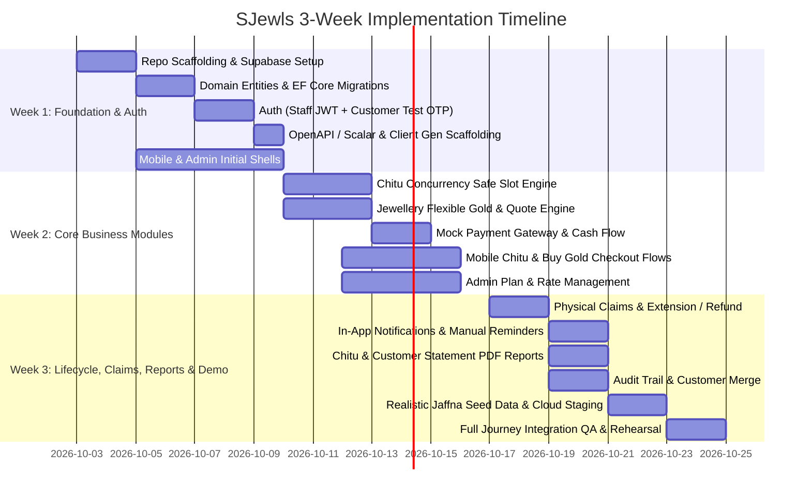

# SJewls — Technical Review & Development Workflow

**Document Version:** 1.0  
**Target Release:** Working Client Demonstration (~2–3 Weeks)  
**Active Branch:** Jaffna (LKR, `Asia/Colombo`)  

---

## 1. Specification Review & Architectural Evaluation

### 1.1 Key Architectural Strengths
1. **Financial Immutability & Double-Entry Thinking:**
   - Separation of immutable financial transaction records (allocations, contributions, quotes) from mutable workflow states (enrolment status, slot draw status, claim status).
   - Reversals use compensating entries rather than destructive deletes or updates.
2. **Branch & Currency Isolation:**
   - Multi-branch data model ready for future expansion (e.g., Toronto) without currency contamination. No summing across currencies.
   - Timestamps stored strictly in UTC and rendered in the branch's local timezone (`Asia/Colombo`).
3. **Strict Authorisation Boundaries:**
   - Roles (Super Admin, Branch Admin, custom staff) and branch restrictions enforced strictly at the API layer, not relying on client UI hiding.
4. **Provider-Neutral Payment Abstraction:**
   - Decoupled payment processing supporting both mock online flows (with simulated pending, success, cancel, failure) and immediate in-store cash recording by authorised staff.
5. **Contract-First Verification via Scalar:**
   - Centralised `/openapi/v1.json` and `/scalar/v1` documentation driving client type generation for both Next.js admin and React Native mobile.

---

## 2. Resolutions for Section 19 Implementation Decisions

To avoid blocking development, the following recommended policies address the open items from Section 19:

| Area | Decision Item | Recommended Technical Policy |
|---|---|---|
| **Chitu** | **Slot Number Allocation & Reuse** | Slot numbers are allocated strictly monotonically (`1` to `N`). Cancelled/closed historical numbers are **never** reassigned. Active capacity = `Total Capacity - (Active Slots + Pending Reservations)`. |
| **Chitu** | **Late Joining** | Permitted up to Month 3 (or configured cutoff) only if the customer pays all accumulated past monthly instalments in a single initial transaction before slot assignment. |
| **Chitu** | **Advance Payments After Win** | If a slot with advance prepaid instalments wins, the unconsumed future instalments are credited as a transferable jewellery voucher / store credit or refunded to the customer upon admin confirmation. |
| **Chitu** | **Draw Correction** | Restricted to Super Admin role with mandatory audit remark. Requires rolling back benefit status from `Unclaimed` (cannot rollback if already `Claimed`), reopening the slot, and recording the corrected draw. |
| **Jewellery** | **Target & Charges Interaction** | Two-part target validation: (1) `Saved Grams >= Product Gold Weight` AND (2) `Accumulated Cash Contributions >= Total Target (Gold Value + Making Charges + VAT)`. |
| **Jewellery** | **Quote Rate-Lock Duration** | **10 minutes** time-to-live (`TTL`) on server-generated payment quotes. If unpaid within 10 minutes, the client must request a refreshed quote. |
| **Jewellery** | **Refunds with High Fees** | `Net Refund = max(0, Total Contributed Currency - Cancellation Fee)`. The customer is never charged an out-of-pocket deficit if contributions are lower than a fixed fee. |
| **Staff Auth** | **Authentication Mechanism** | ASP.NET Identity with Argon2id password hashing, issuing branch-scoped JWT bearer tokens with refresh token rotation. |
| **Customer Auth** | **Staging OTP Delivery** | Deterministic test OTP (`123456`) in staging/development mode, guarded by `ASPNETCORE_ENVIRONMENT != Production`. |

---

## 3. System Architecture & Repository Structure

```
SJew/
├── docs/
│   ├── PROJECT_SPECIFICATION.md
│   └── WORKFLOW_AND_ARCHITECTURE.md
├── backend/                  # Developer 1: sjewls-api (ASP.NET Core 9 / .NET 8)
│   ├── src/
│   │   ├── SJewls.Domain/    # Pure entities, domain events, business rules
│   │   ├── SJewls.Application/# CQRS / MediatR commands, queries, DTOs, interfaces
│   │   ├── SJewls.Infrastructure/ # EF Core, Supabase PostgreSQL, Storage, Mock Payments
│   │   └── SJewls.Api/       # Controllers/Minimal APIs, OpenAPI/Scalar, Auth middleware
│   └── tests/
│       ├── SJewls.Domain.Tests/
│       └── SJewls.IntegrationTests/
├── admin/                    # Developer 1: sjewls-admin (Next.js 15, App Router, TypeScript)
│   ├── src/
│   │   ├── app/              # Dashboard, Chitu, Jewellery, Customers, Rates, Reports
│   │   ├── components/       # UI components, data tables, modal dialogs
│   │   ├── lib/              # Generated API client, auth session, branch context
│   │   └── styles/           # Modern Maroon & Gold theme
├── mobile/                   # Developer 2: sjewls-mobile (React Native / Expo SDK 52)
│   ├── src/
│   │   ├── navigation/       # Auth stack, Tab navigator, Plan details
│   │   ├── screens/          # Onboarding, OTP, Chitu, Buy Gold, Balances, History
│   │   ├── services/         # Generated API client, storage
│   │   └── i18n/             # Localisation scaffolding (English active, Tamil ready)
└── shared/                   # OpenAPI specs, generated client types, scripts
    ├── openapi/
    │   └── openapi.json
    └── seed/
        └── jaffna_demo_seed.sql
```

---

## 4. 3-Week Staged Development Roadmap



### Detailed Breakdown by Week

#### **Week 1: Foundations, Schema & Identity (Developer 1 & 2)**
- **Backend (Dev 1):**
  - Initialize clean architecture solution (`SJewls.Api`, `Application`, `Domain`, `Infrastructure`).
  - Configure Supabase PostgreSQL with EF Core code-first migrations.
  - Implement Identity & Auth:
    - Customer login/register with test OTP (`123456`).
    - Staff login with email/password and branch-level role claims.
  - Configure OpenAPI generation with Scalar documentation UI at `/scalar/v1`.
- **Mobile (Dev 2):**
  - Scaffold Expo TypeScript application with Maroon & Gold theme tokens.
  - Implement i18n localization keys (English active, Tamil scaffolding).
  - Implement Onboarding, Phone/Email entry, OTP input, and Secure Token storage.
- **Admin (Dev 1):**
  - Scaffold Next.js project with role-based routing layout, theme tokens, and Auth middleware.

---

#### **Week 2: Core Plans, Calculations & Payments (Developer 1 & 2)**
- **Chitu Plan Engine:**
  - Database table locking (`SELECT FOR UPDATE`) or atomic SQL decrement to guarantee zero overselling.
  - Ascending lowest-number slot allocation upon payment confirmation.
  - Schedule generator for monthly instalments (handling 28th/30th/31st due dates).
  - Physical draw recording endpoint (validating that only slots paid through the draw month are eligible).
- **Jewellery Plan Engine:**
  - Branch-specific gold rate lookup by Karat (22k / 24k).
  - Quote generation endpoint: calculates grams from LKR or LKR from grams, lock-in for 10 minutes.
  - Contribution ledger recording permanent grams, rate, and currency values.
- **Payments Engine:**
  - Provider-neutral `IPaymentProvider` abstraction.
  - `MockOnlinePaymentProvider` supporting simulated states (Success, Failed, Cancelled, Pending).
  - Cash payment recording by authorised staff.
  - Atomic confirmation: payment success triggers slot allocation / contribution ledger updates in a single database transaction.
- **Mobile & Admin UI Integration:**
  - Mobile: Chitu plan cards, quantity selector, checkout, owned slots, instalment payment screen.
  - Mobile: Jewellery product viewer, "Buy Gold" modal (switch between LKR / grams), contribution balance history.
  - Admin: Chitu management, slot grid viewer, draw entry modal, gold rate history manager, cash payment recorder.

---

#### **Week 3: Requests, Claims, Notifications, PDF Reports & Staging**
- **Lifecycle & Claims:**
  - End-of-plan assessment logic (checking target vs savings).
  - Customer request endpoints: Extension request and Early-closure request.
  - Admin decision endpoints: Approve extension, or calculate cancellation fee and process refund.
  - Physical Claim completion: In-store handover recording staff, date, remarks (no online customer claim approval).
- **Notifications & Audit:**
  - Persistent In-App notification table with read/unread tracking.
  - Admin announcement broadcast tool (Module / Plan / Customer specific).
  - Auditing interceptor: recording actor, action, timestamp, old/new values on all mutations.
- **Reporting & Sample Data:**
  - PDF generation for Chitu-wise status and Customer Account Statement.
  - Fictional Jaffna branch seed data (plans, customers, active/winning slots, contributions).
- **Staging Deployment & Verification:**
  - Deploy API to Render / Fly.io with Supabase PostgreSQL.
  - Deploy Admin to Cloudflare Pages / Vercel.
  - Mobile build deployment via Expo EAS / development client.
  - Run comprehensive verification against Section 18 acceptance criteria.

---

## 5. Immediate Next Steps & Decisions for the User

1. **Workspace Directory Structure:**
   Confirm whether to create the 3 project directories (`backend/`, `admin/`, `mobile/`) inside this repository workspace (`/Users/sagee/Desktop/SJew`).
2. **Environment & Tooling:**
   - `.NET SDK`: Since `dotnet` was not detected in PATH, we will provide installation instructions or prepare scripts to install .NET 8/9 SDK via Homebrew (`brew install dotnet-sdk`).
   - `Expo / React Native`: Ready with Node v25 and npm.
3. **Supabase Project Credentials:**
   Provide the Supabase PostgreSQL connection string and Project URL/Anon Key so EF Core migrations and storage can be connected from Day 1.
